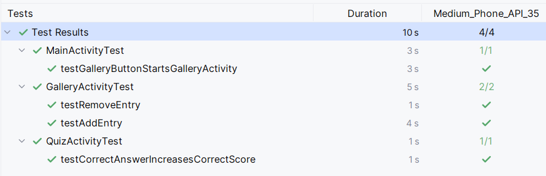

# Test Cases and Results
- All tests inherit from a base class called `ActivityTestWithInMemoryDatabase`
- It provides a method to initialize an in-memory Room database and seed it with sample data

## Main Activity Test
- **Description:** When the user clicks on the "Gallery" button in the main menu, the app should launch the `GalleryActivity`.
- **Expected Result:** The `GalleryActivity` should be started successfully.
- **Result:** Passed ✅
- **Implementation**: `MainActivityTest.testGalleryButtonStartsGalleryActivity`

## Quiz Activity Test
- **Description:** When the user selects the correct answer in the quiz, the correct score should increase. When the user selects an incorrect answer, the incorrect score should increase.
- **Expected Result:**
  - Selecting the correct answer should increase the correct score.
  - Selecting an incorrect answer should increase the incorrect score.
- **Result:** Passed ✅
- **Implementation**: `MainActivityTest.testGalleryButtonStartsGalleryActivity`

## Gallery Activity Test

### Test: Remove Entry
- **Description:** When the user clicks the delete button on an entry in the gallery, the entry should be removed from the list.
- **Expected Result:**
  - The initial number of entries should be 3.
  - After deleting one entry, the number of entries should be 2.
- **Result:** Passed ✅
- **Implementation**: `GalleryActivityTest.testRemoveEntry`

### Test: Add Entry
- **Description:**
  - When the user clicks the "Add Entry" button in the gallery, the `AddEntryActivity` activity should be started.
  - Then, the user fills in the new entry name, clicks the button to select an image, which should open the image picker.
  - Once the image is selected, the user clicks the "Save" button, and the new entry should be added to the gallery list.
- **Expected Result:**
  - The initial number of entries should be 3.
  - After adding a new entry, the number of entries should be 4.
- **Result:** Passed ✅
- **Implementation**: `GalleryActivityTest.testAddEntry`

